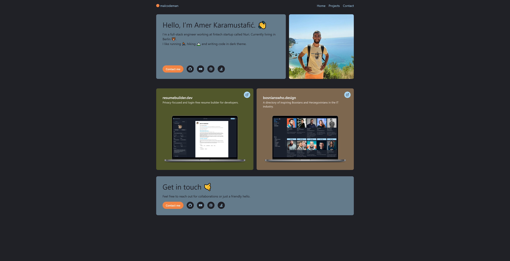

# [malcodeman.com](https://www.malcodeman.com) 🧔

My online portfolio. Made with performance in mind. ⚡

## License

This project is licensed under the MIT License - see the [LICENSE](LICENSE) file for details.
